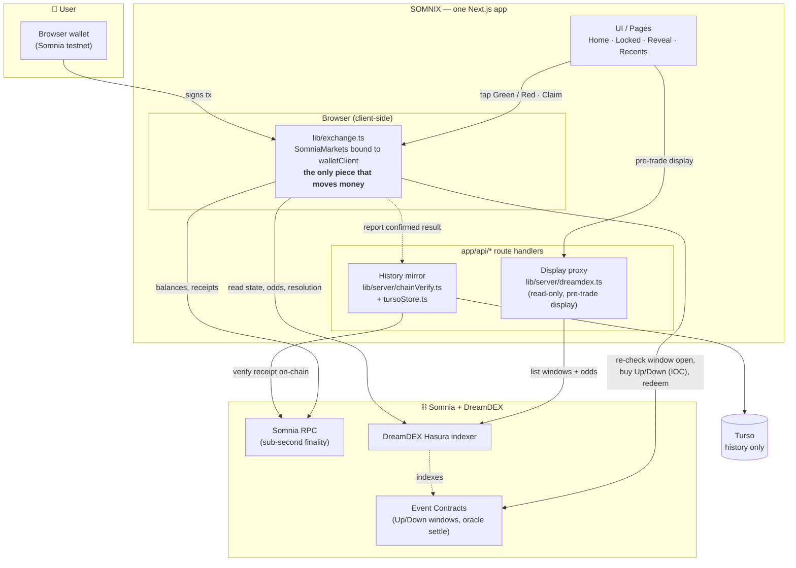

# SOMNIX

**Live: [somnix-iota.vercel.app](https://somnix-iota.vercel.app)** — Somnia Shannon testnet.

**Lock one call for this window. Hide the price. See the result when the timer ends.**

Built for the Somnia × DreamDEX Event Contracts Hackathon.

---

## What is SOMNIX

SOMNIX is a scalp-style directional prediction game built on top of
[DreamDEX Event Contracts](https://docs.dreamdex.io/developers/event-contracts)
on Somnia. Every short window (1 minute up to 1 hour), DreamDEX already runs a
simple on-chain market:

- **Green (Up)** — the coin finishes at or above the price when the window started
- **Red (Down)** — the coin finishes below that start price

SOMNIX turns that market into a single **decision**, not a trading screen. You
pick BTC or ETH, choose Green or Red and an amount, and tap once. Your stake
buys the real outcome token on-chain. Then the live price disappears until the
window ends — so you stop refreshing the chart. Come back at 0:00 to see if you
were right, and claim if you won.

No order book to read. No leverage. No exchange jargon. You can only ever lose
what you put in.

---

## The problem

People already play the game of *"is Bitcoin green this hour?"* in their heads.
Then they do one of two things:

- Keep opening the chart every few seconds, or
- Open a leveraged trade — and lose **more** than they meant to.

The question is small. The habit is loud. Normal trading apps make the habit
worse, because they never stop showing you the price. **The real problem is that
you cannot put the phone down.**

---

## The solution we offer

**Lock & Reveal.**

- **One call per window.** You are deciding, not day-trading.
- **The price is hidden after you lock** — no live chart until the window ends.
  This is the product; it breaks the refresh habit on purpose.
- **A hard cap:** the most you can lose is the amount you chose. No leverage,
  nothing to liquidate.
- **Claim is part of the flow.** Winnings don't appear by magic — when your side
  wins on-chain, you claim ~1.92× in one tap.
- **Same again** on the next window, so you never have to hunt for a new market.
- **Watch mode** for people who aren't ready to connect a wallet.
- **Friend card** so a new person understands the same question in one screen.

DreamDEX runs the real market and the real payout rules. SOMNIX is the calm
decision layer on top.

### The four screens

| Screen | Role |
| --- | --- |
| **Home** — "This window" | Coin, window length, time left, live Green/Red odds, amount buttons, and the two big Green/Red buttons. Understand the question and lock a call. |
| **Locked** — "Put the phone down" | Your side, amount, and a countdown. **No live chart, no live price.** This screen *is* the product. |
| **Reveal + Claim** — "What happened" | Start price vs. result, win/lose, and a one-tap **Claim** for winners. Then *Same again* on the next window. |
| **Recents + Share** — "How you did" | Your last few windows as a score, plus **share a friend card**. |

Watch mode uses Home + Recents only — no wallet, no tap, no claim.

---

## Architecture

SOMNIX is **chain-first** and ships as **one Next.js app** — there is no
separate backend service.

The single invariant that governs the whole design: *a user's real, already-signed
on-chain action must never become invisible to the app, and the UI never shows a
currency label, live-market status, or payout number that isn't backed by a real
on-chain or indexer read.*

There are three distinct access paths inside the one app, each with a different
trust level:

1. **Browser SDK client** (`frontend/src/lib/exchange.ts`) — the only piece
   that moves money. A `SomniaMarkets` instance bound to the user's own `viem`
   `walletClient`. Locking, claiming, and resolution checks all go through it,
   talking directly to the DreamDEX indexer and Somnia RPC from the browser.
   This can never move server-side: it needs a signature only the user's wallet
   can produce.
2. **Server display proxy** (`app/api/markets/*`, `lib/server/dreamdex.ts`) —
   unauthenticated, read-only. Reads the DreamDEX indexer for pre-trade display
   (market list, odds preview) without CORS/rate-limit pain. **Never** consulted
   before a signature; the client always re-checks on-chain state right before a
   tap, because a stale cached list must never authorize a spend.
3. **Server history mirror** (`app/api/lock/*`, `app/api/claim/*`, Turso-backed;
   posted from `lib/history.ts`) — receives a report only *after* the browser
   already holds a confirmed on-chain result, and every write is verified
   against a real receipt (`lib/server/chainVerify.ts`) before being stored.
   Holds no funds, no keys, no accounts, and gates nothing.

`docs/API_NOTES.md` is the source of truth for the endpoint-by-endpoint API
surface and every external dependency's measured failure modes.

### Project structure

```text
frontend/
  src/
    app/
      api/                       # Route handlers (display proxy + history mirror only)
        markets/                 #   read DreamDEX indexer for display
        card/                    #   render the friend/share card image
        lock/, claim/            #   mirror a client-confirmed action into Turso
      trade/, locked/, reveal/, recents/   # The four pages
      layout.tsx, page.tsx, globals.css
    components/                  # UI (LandingPage, MarketWindow, WalletModal, ...)
    lib/
      exchange.ts                # Browser SDK client — the ONLY piece that moves money
      somnia.ts                  # Chain config + collateral token reads
      marketService.ts           # Pending-lock-intent persistence, market fetch/display
      history.ts                 # Fire-and-forget POSTs to the history mirror
      useSomnix.tsx              # App state, wallet binding, pending-lock reconciliation
      server/
        dreamdex.ts              # Server-side indexer read (display proxy only)
        chainVerify.ts           # Verifies a reported tx really confirmed on-chain
        tursoStore.ts            # Turso (libSQL) persistence for the history mirror
  .env.example
docs/
  API_NOTES.md                   # Measured behavior of every external API
  DREAMDEX_AND_SOMNIA.md         # Protocol/integration reference
  LIMITATIONS.md                 # What's explicitly not handled yet
  THREAT_MODEL.md                # Trust boundaries, key-compromise analysis
```

### Tech stack

- **App:** Next.js 16 + TypeScript (strict), Tailwind CSS v4, framer-motion.
- **Chain:** Somnia Shannon testnet (Chain ID `50312`), `viem` for wallet + RPC.
- **Markets:** `@somnia-chain/markets-sdk` (≥ 0.28.0) — Event Contracts (Up/Down
  windows) and the DreamDEX Hasura indexer for listing. The testnet chain and
  contract addresses are imported straight from the SDK (`somniaShannon`,
  `SOMNIA_TESTNET_ADDRESSES`), not env vars.
- **Persistence:** Turso (libSQL over HTTP) for the read-only history mirror.

---

## How SOMNIX integrates with DreamDEX & Somnia



**What DreamDEX does vs. what SOMNIX does:**

| What you see | What DreamDEX is doing |
| --- | --- |
| "BTC this hour" | A live Up/Down window for BTC |
| Timer | Official end time of that window |
| 58% Green | Price on the live order book (a number between 0 and 1) |
| You tap Green / Red | The app **buys Up / Down** for you, right now (IOC — fill now, leave no resting order) |
| Locked call | You hold a result token for that window |
| Window ends | DreamDEX's oracle compares the real end price to the start price |
| Claim | The app redeems a winning token back into your funds |
| Same again | The app loads the **next** live window for that coin and length |

SOMNIX does **not** build its own betting system — it uses DreamDEX Event
Contracts for the real bets, real prices, and real win/lose rules. The indexer
is a display convenience; on-chain state is always re-verified on the client
right before any spend.

---

## How to run

```bash
git clone https://github.com/davre001/Somnix.git
cd Somnix
pnpm install
cp frontend/.env.example frontend/.env.local   # Turso vars for the history mirror (optional for local dev)
pnpm dev                  # http://localhost:3000

# Required checks
pnpm lint && pnpm typecheck && pnpm test && pnpm build
```

Only `NEXT_PUBLIC_DREAMDEX_INDEXER_URL` (public, defaults to the real testnet
indexer) is a client-side value; `TURSO_DATABASE_URL` / `TURSO_AUTH_TOKEN`
(server-only) back the history mirror. To run a real end-to-end lock and claim
you'll also need a browser wallet on Somnia testnet, test funds from the
hackathon faucet, and at least one live BTC or ETH window. **Watch mode needs
only the app and a live window — no wallet.**

---

## Future plans

- **More assets and window lengths** beyond BTC/ETH as DreamDEX lists them,
  surfaced automatically from the live registry rather than hard-coded.
- **Richer friend cards** — animated, per-result share cards and deep links that
  drop a friend straight onto the exact window you called.
- **A streak / score layer** on top of Recents: personal history, win streaks,
  and light seasonal leaderboards — display-only, still backed by on-chain reads.
- **Push-style reveal reminders** so you get a nudge exactly at 0:00 instead of
  having to remember the window yourself.
- **Mainnet readiness** once Event Contracts move to Somnia mainnet — the
  chain-first architecture already keeps money strictly client-side, so the path
  is a network switch plus a hardening pass, not a rewrite.
- **Deeper accessibility and i18n** so the "one calm decision" experience reads
  the same for everyone.

See [`docs/LIMITATIONS.md`](docs/LIMITATIONS.md) for what is explicitly not
handled yet, and [`docs/THREAT_MODEL.md`](docs/THREAT_MODEL.md) for trust
boundaries.
