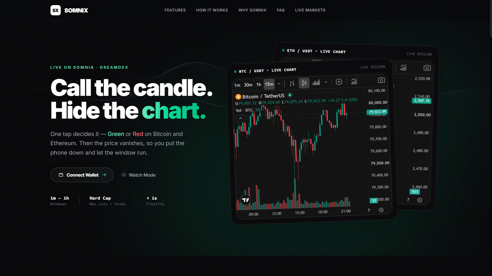
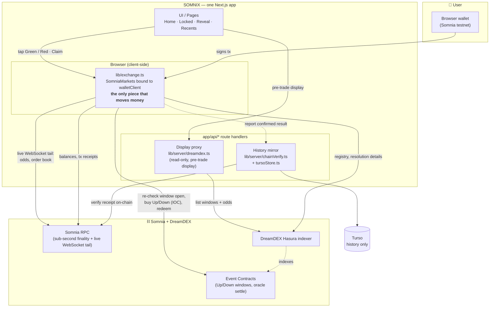

# SOMNIX

<div align="center">



</div>

[](https://somnix-iota.vercel.app)
[](https://shannon-explorer.somnia.network)
[](https://shannon-explorer.somnia.network)
[](https://docs.dreamdex.io/developers/event-contracts)
[](https://nextjs.org)
[](https://www.typescriptlang.org)
[](https://tailwindcss.com)
[](https://viem.sh)
[](https://github.com/davre001/Somnix/actions/workflows/ci.yml)

**Live: [somnix-iota.vercel.app](https://somnix-iota.vercel.app)** — Somnia Shannon testnet.

**Lock one call for this window. Hide the price. See the result when the timer ends.**

Built for the Somnia × DreamDEX Event Contracts Hackathon.

---

## Watch the demo

<div align="center">

**<iframe width="560" height="315" src="https://www.youtube.com/embed/XB_I94tpW5c?si=ufpWHHPsWrxDYrGu" title="YouTube video player" frameborder="0" allow="accelerometer; autoplay; clipboard-write; encrypted-media; gyroscope; picture-in-picture; web-share" referrerpolicy="strict-origin-when-cross-origin" allowfullscreen></iframe>**

</div>

---

## Judge this in 90 seconds

**Live app:** [somnix-iota.vercel.app](https://somnix-iota.vercel.app) — the full product, including watch mode (no wallet needed to see the core loop).

| | |
|---|---|
| **1 tap** | to lock a real on-chain position — no order book, no leverage, no chart during the window |
| **133 tests** | in CI on every push/PR — `lint`, `typecheck`, `test`, `build` as four separate jobs |
| **2 real bugs** | found and fixed via *reproduced* testnet transactions this build, not code review alone (see [Tested against reality](#tested-against-reality-not-vibes) below) |
| **0 fabricated numbers** | every price, odds, and payout the UI shows is backed by a live on-chain or indexer read — see the [Architecture](#architecture) trust boundary |

```bash
git clone https://github.com/davre001/Somnix.git && cd Somnix
pnpm install
pnpm dev                                # http://localhost:3000 — watch mode needs nothing else
pnpm lint && pnpm typecheck && pnpm test && pnpm build   # what CI actually runs
```

To try a real lock/claim instead of watch mode: connect a wallet on Somnia Shannon testnet, get STT for gas (wallet-menu link) and test collateral (in-app **+Faucet**), then pick any live BTC/ETH window.

---

## Table of contents

- [Watch the demo](#watch-the-demo)
- [What is SOMNIX](#what-is-somnix)
- [Tested against reality, not vibes](#tested-against-reality-not-vibes)
- [The problem](#the-problem)
- [The solution we offer](#the-solution-we-offer)
- [Architecture](#architecture)
- [How SOMNIX integrates with DreamDEX & Somnia](#how-somnix-integrates-with-dreamdex--somnia)
- [Honesty: limitations](#honesty-limitations)
- [How to run](#how-to-run)
- [Roadmap](#roadmap)
- [Attribution](#attribution)

---

## What is SOMNIX

SOMNIX is a scalp-style directional prediction game built on top of
[DreamDEX Event Contracts](https://docs.dreamdex.io/developers/event-contracts)
on Somnia. Every short window (1 minute up to 1 hour), DreamDEX already runs a
simple on-chain market:

- **Green (Up)** — the coin finishes at or above the price when the window started
- **Red (Down)** — the coin finishes below that start price

SOMNIX turns that market into a single **decision**, not a trading screen. You
pick BTC or ETH, choose Green or Red and a stake, and tap once. Your stake
buys the real outcome token on-chain, priced live by the order book. Then the
price disappears until the window ends — so you stop refreshing the chart.
Come back at 0:00 to see if you were right, and claim if you won.

No order book to read. No leverage. No exchange jargon. You can only ever lose
what you put in.

---

## Tested against reality, not vibes

Two real bugs in this build were found by reproducing a transaction against a
live testnet wallet and a live order book — not by reading the code and
deciding it looked right. Both are fixed in the current code; the numbers
below are what the *unfixed* version actually did, captured from real runs.

**Bug 1 — a claim that could never succeed.** `frontend/scripts/live-cycle.mjs`
(a real, funded testnet wallet, `live:`-prefixed so it never runs in CI) locked
5 tUSDC on a real BTC 1h window (fill price `0.843`, tx `0x5ade91...`), the
window resolved Green on-chain, and the position was claimed for a real payout
(tx `0xbd67ef...`) — collateral balance moved `10,000 → 10,000.965` tUSDC,
exactly the expected 1:1 redemption. Getting that claim to succeed at all
surfaced a real bug first: the SDK's unified `exchange.redeem()` resolves a
market through its live-markets registry, which excludes already-resolved
markets by design — so the original claim path threw `"unknown market ref"`
on every real claim, no matter how many times `loadMarkets()` was called
first. Fixed by reading the market directly by id and calling the raw
`trader.redeem()` instead, bypassing the registry entirely
(`exchange.ts#claimWinnings`).

**Bug 2 — a lock that risked less than it showed.** `frontend/scripts/verify-order-amount-semantics.mjs`
places one real market order against the live SDK's unified `createOrder(...)`
call and diffs the wallet's real collateral balance before/after. The SDK
treats `amount` as a **token quantity**, not collateral. Reproduced twice, on
different days and at different live prices — same conclusion both times:

```text
Wallet: 0xEE993d1C41f74faD3cddAf59E9cdc30b5a80fa42

Placing MARKET BUY: amount=5 on BTC-7990246-06SEP26-2135/tUSDC#YES...
Order result: {
  txHash: '0x4fa81241cc1eeabd71d9d3a661d8aeeae882a5e2b95fbca3bc41456fbaf182bf',
  filled: 5,
  price: 0.602,
  cost: undefined,
  amount: 5
}

--- Collateral (tUSDC) ---
Before: 19998.39 | After: 19995.47 | Spent: 2.920000
Hypothesis A (amount == collateral spent): expected 5, actual 2.920000, match = false
```

Requesting `amount=5` filled exactly 5 tokens and spent **$2.92** real
collateral — not $5. (An earlier run at a different live price spent $2.575
for the same `amount=5` — the token count matches every time, the dollar
figure never does.) A user who typed "lock $10" was silently risking whatever
`10 × price` happened to be at that moment, while the UI displayed "Lock
Amount: 10" as if the full $10 were at stake. Fixed by sizing every lock
through the SDK's own `quoteBinaryStake` (walks the real book so escrow
never exceeds the requested stake) before placing the order
(`exchange.ts#lockPosition`).

Both scripts are still in the repo and still runnable against a funded
testnet wallet — the claim is falsifiable, not just asserted. See
[`docs/API_NOTES.md`](docs/API_NOTES.md) §1/§1a for the full write-up of each,
including the exact SDK behavior that caused them.

---

## The problem

People already play the game of *"is Bitcoin green this hour?"* in their heads.
Then they do one of two things:

- Keep opening the chart every few seconds, or
- Open a leveraged trade — and lose **more** than they meant to.

The question is small. The habit is loud. Normal trading apps make the habit
worse, because they never stop showing you the price. **The real problem is that
you cannot put the phone down.**

---

## The solution we offer

**Lock & Reveal.**

- **One call per window.** You are deciding, not day-trading.
- **The price is hidden after you lock** — no live chart until the window ends.
  This is the product; it breaks the refresh habit on purpose.
- **A hard cap:** the most you can lose is the amount you chose. No leverage,
  nothing to liquidate.
- **Claim is part of the flow.** Winnings don't appear by magic — when your side
  wins on-chain, you claim in one tap, at whatever the live order book actually
  priced when you locked. Never a fabricated or fixed number.
- **Same again** on the next window, so you never have to hunt for a new market.
- **Watch mode** for people who aren't ready to connect a wallet.
- **Friend card** so a new person understands the same question in one screen.

DreamDEX runs the real market and the real payout rules. SOMNIX is the calm
decision layer on top.

### Built-in guardrails, not just a game

The habit SOMNIX is fighting doesn't stop at one window, so neither do the
protections:

- **Session budget** — an optional, self-set cap on total collateral locked in
  one sitting. Once you hit it, locking is blocked until you raise it or reset.
- **Loss-streak cooldown** — after 3 losses in a row, the next lock attempt
  shows a soft, dismissible "take a break?" prompt instead of firing
  immediately. It's the one feature here that works *against* short-term
  volume on purpose.
- **Structured pre-lock checklist** — every gating condition (live market,
  time left, amount, balance, session budget, duplicate window) shown at once,
  not a single disabled button with a vague tooltip.

### The four screens

| Screen | Role |
| --- | --- |
| **Home** — "This window" | Coin, window length, time left, live Green/Red odds, amount buttons, and the two big Green/Red buttons. Understand the question and lock a call. |
| **Locked** — "Put the phone down" | Your side, amount, and a countdown. **No live chart, no live price.** This screen *is* the product. |
| **Reveal + Claim** — "What happened" | Start price vs. result, win/lose, and a one-tap **Claim** for winners. Then *Same again* on the next window. |
| **Recents + Share** — "How you did" | Your last few windows as a score — wins *and* losses — plus **share a friend card**. |

Watch mode uses Home + Recents only — no wallet, no tap, no claim.

---

## Architecture

SOMNIX is **chain-first** and ships as **one Next.js app** — there is no
separate backend service.

The single invariant that governs the whole design: *a user's real, already-signed
on-chain action must never become invisible to the app, and the UI never shows a
currency label, live-market status, or payout number that isn't backed by a real
on-chain or indexer read.*

There are three distinct access paths inside the one app, each with a different
trust level:

1. **Browser SDK client** (`frontend/src/lib/exchange.ts`) — the only piece
   that moves money. A `SomniaMarkets` instance bound to the user's own `viem`
   `walletClient`. Locking, claiming, and resolution checks all go through it,
   talking directly to the DreamDEX indexer and Somnia RPC from the browser.
   This can never move server-side: it needs a signature only the user's wallet
   can produce.
2. **Server display proxy** (`app/api/markets/*`, `lib/server/dreamdex.ts`) —
   unauthenticated, read-only. Reads the DreamDEX indexer for pre-trade display
   (market list, odds preview) without CORS/rate-limit pain. **Never** consulted
   before a signature; the client always re-checks on-chain state right before a
   tap, because a stale cached list must never authorize a spend.
3. **Server history mirror** (`app/api/lock/*`, `app/api/claim/*`, Turso-backed;
   posted from `lib/history.ts`) — receives a report only *after* the browser
   already holds a confirmed on-chain result, and every write is verified
   against a real receipt (`lib/server/chainVerify.ts`) and a well-formed
   wallet address (`lib/server/validators.ts`) before being stored. Holds no
   funds, no keys, no accounts, and gates nothing.

`docs/API_NOTES.md` is the source of truth for the endpoint-by-endpoint API
surface and every external dependency's measured failure modes.

### Project structure

```text
frontend/
  src/
    app/
      api/                       # Route handlers (display proxy + history mirror only)
        markets/                 #   read DreamDEX indexer for display
        card/                    #   render the friend/share card image
        lock/, claim/            #   mirror a client-confirmed action into Turso
      trade/, locked/, reveal/, recents/   # The four pages
      layout.tsx, page.tsx, globals.css
    components/                  # UI — LandingPage, WalletModal, LockChecklist,
                                  #   SessionBudget, LossStreakPrompt, RecentsList, ...
    lib/
      exchange.ts                # Browser SDK client — the ONLY piece that moves money
      somnia.ts                  # Chain config + collateral token reads
      marketService.ts           # Local persistence: pending-lock intents, recents, session budget
      history.ts                 # Fire-and-forget POSTs to the history mirror
      useSomnix.tsx              # Thin context composing the hooks below
      hooks/
        useWallet.ts              #   provider connection, network switch, faucet
        useMarket.ts               #   window selection + live (WebSocket) market feed
        useLock.ts                 #   lock validation, execution, session budget, reconciliation
        useClaim.ts                #   claim lifecycle + recents / loss-streak history
      server/
        dreamdex.ts               # Server-side indexer read (display proxy only)
        chainVerify.ts             # Verifies a reported tx really confirmed on-chain
        validators.ts              # Strict wallet-address validation for the history mirror
        rateLimit.ts               # Per-IP, per-route rate limiting for app/api/*
        tursoStore.ts              # Turso (libSQL) persistence for the history mirror
  .env.example
docs/
  API_NOTES.md                   # Measured behavior of every external API
  DREAMDEX_AND_SOMNIA.md         # Protocol/integration reference
  LIMITATIONS.md                 # What's explicitly not handled yet
  THREAT_MODEL.md                # Trust boundaries, key-compromise analysis
```

### Tech stack

- **App:** Next.js 16 + TypeScript (strict), Tailwind CSS v4, framer-motion.
- **Chain:** Somnia Shannon testnet (Chain ID `50312`), `viem` for wallet + RPC.
- **Markets:** [`@somnia-chain/markets-sdk`](https://www.npmjs.com/package/@somnia-chain/markets-sdk),
  pinned to an exact version (`0.28.1`, not a caret range — a young SDK
  deserves a deliberate bump, not a silent one) — Event Contracts (Up/Down
  windows) and the DreamDEX Hasura indexer for listing. Live odds and market
  state ride the SDK's own WebSocket tail straight to Somnia's chain RPC
  (`watchMarkets`), not REST polling. The testnet chain and contract addresses
  are imported straight from the SDK (`somniaShannon`,
  `SOMNIA_TESTNET_ADDRESSES`), not env vars.
- **Persistence:** Turso (libSQL over HTTP) for the read-only history mirror.

### Quality & reliability

- **133 tests** across lib, hooks, and components (React Testing Library),
  including a full mocked-SDK lock → resolve → claim integration test — run in
  CI on every push and PR, not just locally.
- **Four independent CI jobs** (`lint`, `typecheck`, `test`, `build`) —
  `.github/workflows/ci.yml` — a green check means the whole app actually
  builds and passes, not just one slice of it.
- **Per-IP rate limiting** on every state-changing and read API route.
- Every external dependency's *measured* (not assumed) behavior — including
  real indexer failure modes reproduced against live testnet — is written down
  in [`docs/API_NOTES.md`](docs/API_NOTES.md), with known gaps kept current in
  [`docs/LIMITATIONS.md`](docs/LIMITATIONS.md) rather than left for a reviewer
  to find.

---

## How SOMNIX integrates with DreamDEX & Somnia



**What DreamDEX does vs. what SOMNIX does:**

| What you see | What DreamDEX is doing |
| --- | --- |
| "BTC this hour" | A live Up/Down window for BTC |
| Timer | Official end time of that window |
| 58% Green | Price on the live order book (a number between 0 and 1) |
| You tap Green / Red | The app sizes a real **stake** against the live book and **buys Up / Down** for you, right now (IOC — fill now, leave no resting order) |
| Locked call | You hold a result token for that window |
| Window ends | DreamDEX's oracle compares the real end price to the start price |
| Claim | The app redeems your winning tokens back into your funds, 1:1 |
| Same again | The app loads the **next** live window for that coin and length |

SOMNIX does **not** build its own betting system — it uses DreamDEX Event
Contracts for the real bets, real prices, and real win/lose rules. The indexer
is a display convenience; on-chain state is always re-verified on the client
right before any spend.

---

## Honesty: limitations

Stated plainly, not left for a reviewer to find:

- **Testnet only.** SOMNIX runs on Somnia Shannon testnet (chain `50312`),
  not mainnet — Event Contracts themselves aren't on mainnet yet.
- **No real settlement/closing price is available from this venue's oracle.**
  The SDK exposes `openingAnswer`/`closingAnswer` for exactly this, but both
  came back `null` on every one of 11 real samples checked. RevealPanel shows
  "—" for Settlement Price rather than fabricate one — win/lose is still
  decided correctly by the real on-chain `winningOutcome`, never by a price
  comparison in this app.
- **History (Recents) is local-only, per-device.** A pending-lock intent is
  reconciled against the real chain the next time a signer binds on *this*
  browser — a user who never reopens SOMNIX on the same device after a
  dropped connection won't see it recovered in the UI, even though the
  on-chain position itself is fine.
- **The backend history mirror doesn't re-derive exact fill numbers from
  the chain** — it verifies the transaction is real and sent by the claimed
  wallet, not that the reported `filledAmount`/`fillPrice` exactly matches
  the decoded fill. The UI now labels this "self-reported" in Recents. This
  never affects a real claim, which always re-checks the live chain.
- **Rate limiting is in-memory, per-instance, not distributed** — bounds a
  single serverless instance against naive hammering, not a coordinated
  attack across instances.
- **The DreamDEX indexer has measurable, intermittent latency/outages** —
  reproduced directly against the live indexer this build (a plain market
  query timing out with a `504` while the same endpoint answered a trivial
  query in under a second). This is an external dependency's behavior, not
  something this app controls; it's why lock/claim errors are surfaced as
  an honest "try again shortly" rather than swallowed or retried silently.

Full detail on every gap above, plus what's explicitly *not* defended against,
in [`docs/LIMITATIONS.md`](docs/LIMITATIONS.md) and
[`docs/THREAT_MODEL.md`](docs/THREAT_MODEL.md).

---

## How to run

```bash
git clone https://github.com/davre001/Somnix.git
cd Somnix
pnpm install
cp frontend/.env.example frontend/.env.local   # Turso vars for the history mirror (optional for local dev)
pnpm dev                  # http://localhost:3000

# Required checks
pnpm lint && pnpm typecheck && pnpm test && pnpm build
```

Only `NEXT_PUBLIC_DREAMDEX_INDEXER_URL` (public, defaults to the real testnet
indexer) is a client-side value; `TURSO_DATABASE_URL` / `TURSO_AUTH_TOKEN`
(server-only) back the history mirror. To run a real end-to-end lock and claim
you'll also need a browser wallet on Somnia testnet, STT for gas (the wallet
menu links Somnia's official faucet), test collateral (the in-app **+Faucet**
button), and at least one live BTC or ETH window. **Watch mode needs only the
app and a live window — no wallet.**

---

## Roadmap

- **A public leaderboard** on top of the session-budget / loss-streak data
  that already exists — "best streak this week," display-only, still backed
  by on-chain reads. The natural next step after the guardrails above.
- **More assets and window lengths** beyond BTC/ETH as DreamDEX lists them,
  surfaced automatically from the live registry rather than hard-coded.
- **Richer friend cards** — animated, per-result share cards and deep links that
  drop a friend straight onto the exact window you called.
- **Push-style reveal reminders** so you get a nudge exactly at 0:00 instead of
  having to remember the window yourself.
- **Mainnet readiness** once Event Contracts move to Somnia mainnet — the
  chain-first architecture already keeps money strictly client-side, so the path
  is a network switch plus a hardening pass, not a rewrite.
- **Deeper accessibility and i18n** so the "one calm decision" experience reads
  the same for everyone.

---

## Attribution

**Protocol** — [DreamDEX Event Contracts](https://docs.dreamdex.io/developers/event-contracts)
run the real markets, prices, and settlement; SOMNIX builds none of that
itself. Accessed via [`@somnia-chain/markets-sdk`](https://www.npmjs.com/package/@somnia-chain/markets-sdk).

**Chain** — [Somnia](https://somnia.network) Shannon testnet.

**Framework** — [Next.js](https://nextjs.org) (MIT), [React](https://react.dev) (MIT),
[Tailwind CSS](https://tailwindcss.com) (MIT), [viem](https://viem.sh) (MIT).

**Persistence** — [Turso](https://turso.tech) (libSQL) for the read-only history mirror.

**Agent** — built with [Claude Code](https://claude.ai/code), including the
empirical bug-finding described in [Tested against reality](#tested-against-reality-not-vibes) above.

See [`docs/LIMITATIONS.md`](docs/LIMITATIONS.md) for what is explicitly not
handled yet, and [`docs/THREAT_MODEL.md`](docs/THREAT_MODEL.md) for trust
boundaries.
